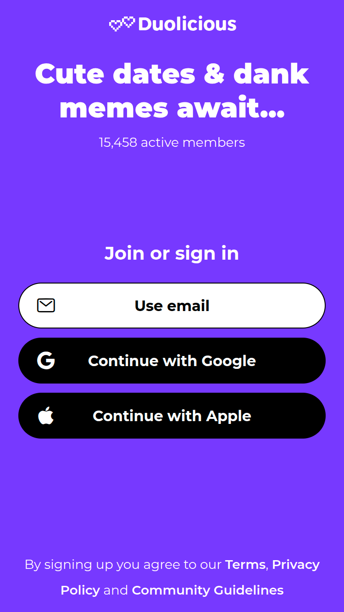
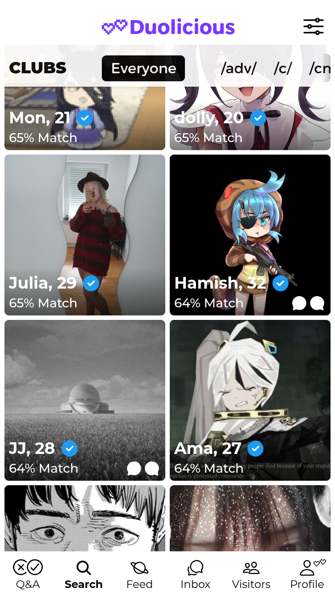
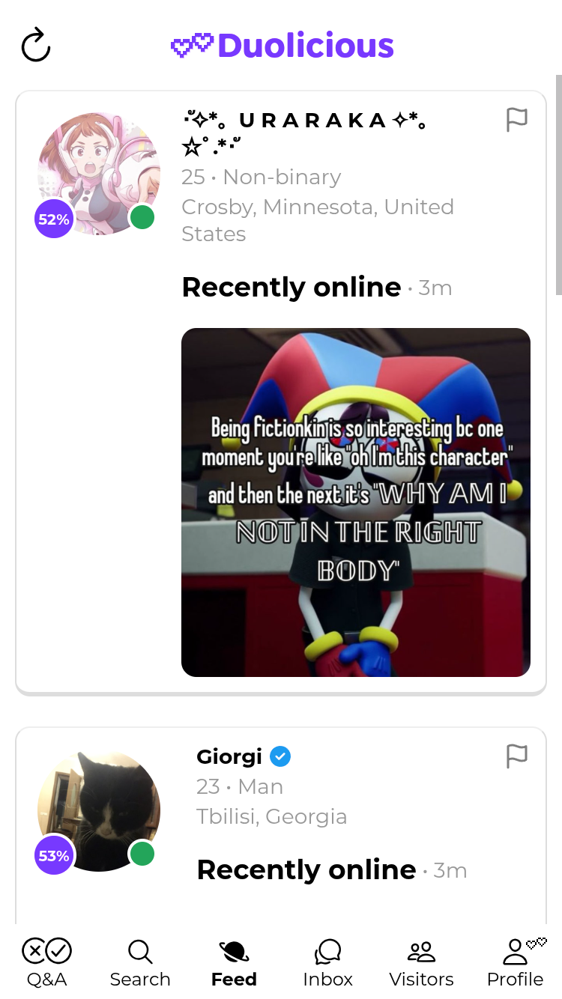
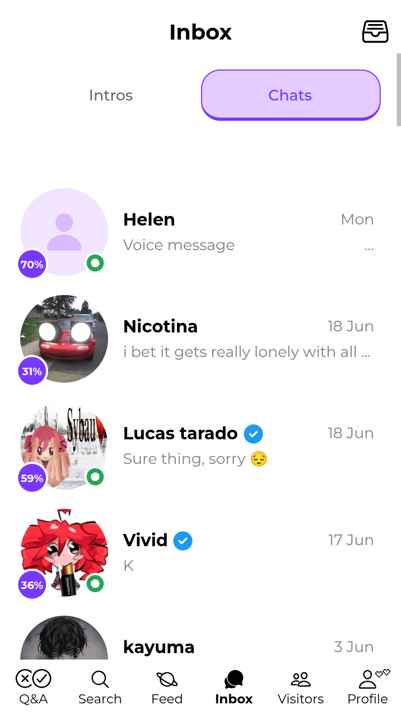
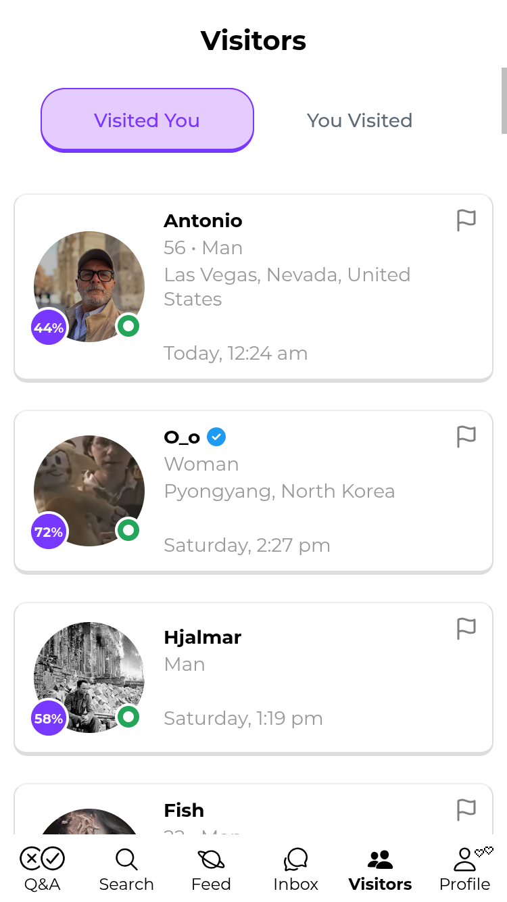
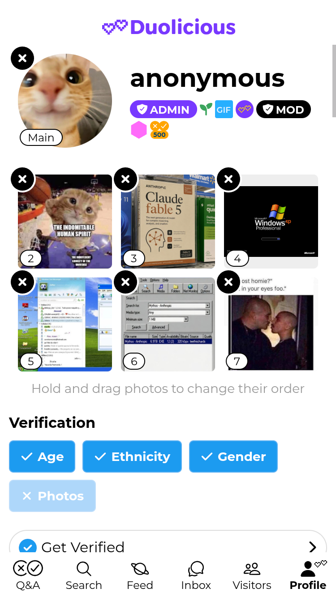
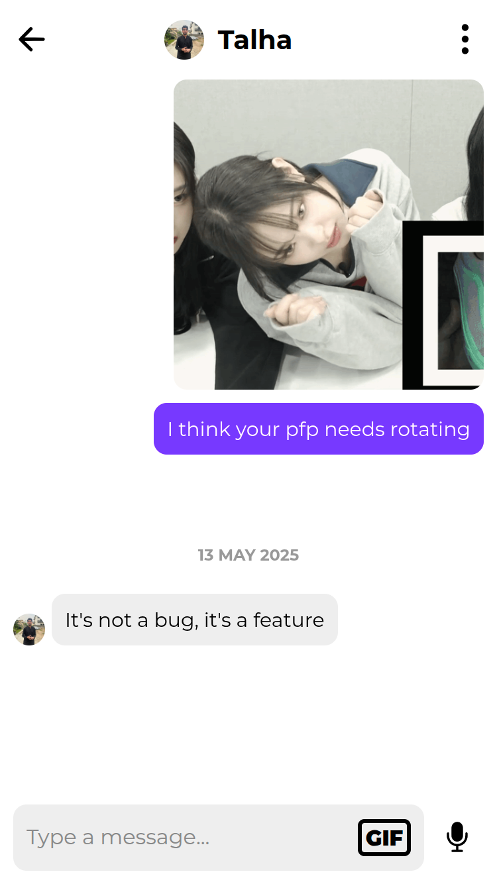

<p align="center">

<h3 align="center">Duolicious</h3>
<p align="center">
The world's most popular open-source dating app.</p>
</p>

<p align="center">
<a href="https://web.duolicious.app/"></a>
<a href="https://play.google.com/store/apps/details?id=app.duolicious"></a>
<a href="https://apps.apple.com/us/app/duolicious-dating-app/id6499066647"></a>
<a href="LICENSE"></a>
<a href="https://x.com/duoliciousapp"></a>
<a href="https://www.reddit.com/r/duolicious/"></a>
</p>

**Duolicious is a personality-based dating app for meeting like-minded people** —
and the whole thing, both the app and the servers behind it, is open source and
right here in this repo. Free as in freedom: read it, run it, fork it, fix it.
No swiping — just real conversations between people who actually match.

Try it now in your browser at **[web.duolicious.app](https://web.duolicious.app/)**,
or grab it on
**[Google Play](https://play.google.com/store/apps/details?id=app.duolicious)**
and the
**[App Store](https://apps.apple.com/us/app/duolicious-dating-app/id6499066647)**.

<p align="center">




</p>
<p align="center">




</p>

## Why people love Duolicious

- **Matched on who you are, not just how you look.** Our question bank has over
  **2,000** thoughtful, fun-to-answer questions covering values, faith,
  politics, sexual compatibility and more. You don't have to answer them all —
  Duolicious shows your best matches after your *first* answer, and the matches
  get better with every response.
- **Real psychological depth.** Beyond familiar traits like the MBTI,
  Duolicious shows how you compare to others on psychometric traits like
  attachment style and thriftiness.
- **Conversations, not swiping.** There's no liking or swiping. People
  introduce themselves by sending a message — and to keep things meaningful,
  Duolicious nudges people away from low-effort openers like "hey" and "sup".
- **Open source, free as in freedom.** The app, API, chat, and infrastructure
  are all in this repo. Anyone can read the code, run their own instance, file
  an issue, or send a fix.
- **Sustainably funded.** Duolicious runs on an optional subscription that keeps
  the servers on and the project alive. The core experience is here for everyone.

## What's in this repo

This monorepo contains both halves of Duolicious:

| Directory | What it is |
| --- | --- |
| [`backend/`](backend/) | The API, chat, cron and supporting services (Python + Postgres). See its [README](backend/README.md) and [DEVELOPER.md](backend/DEVELOPER.md). |
| [`frontend/`](frontend/) | The cross-platform app (Expo / React Native, with a web build). See its [README](frontend/README.md) and [DEVELOPER.md](frontend/DEVELOPER.md). |

## Run the whole app in one command

Requirements: Docker (with Compose v2.20+).

```bash
git clone https://github.com/duolicious/duolicious
cd duolicious
docker compose up
```

That single command builds and starts the entire backend stack **and** the
frontend web app. Once it's up:

- **Frontend (web):** http://localhost:8081
- **API health:** http://localhost:5000/health
- **MailHog (test email UI):** http://localhost:8025
- **Mock S3:** http://localhost:9090
- **Status page:** http://localhost:8080

The frontend's default API URLs already point at the backend's published
localhost ports, so the web app talks to your local backend with no extra
configuration.

To seed a test user once the API is healthy:

```bash
(cd backend && ./test/util/create-user.sh alice 30 1 true)
```

### Working on just one half

You can develop each side on its own — see the per-directory READMEs and
`DEVELOPER.md` files linked in the table above. The root `docker compose up` is
still the easiest way to get everything running at once.

## Tests

CI runs the full test suite for both halves on every push and pull request to
`main` (see [`.github/workflows/`](.github/workflows/)):

- **Backend:** mypy, unit tests, and functionality suites 1–6.
- **Frontend:** ESLint, Jest, Playwright, and TypeScript type checks.

## Contributing

Want to help strangers on the internet find love? There are several ways to
help, and **every one of them matters:**

1. **Spread the word.** Tell your friends and share Duolicious on social media.
   This is genuinely the single best way to help the app grow.
2. **Subscribe.** A subscription keeps the servers running and the project
   sustainable for everyone.
3. **Send a pull request.** Pick up an [open issue](https://github.com/duolicious/duolicious/issues)
   or fix something that bugs you. `docker compose up` gets you a full local
   environment in one step, and developer instructions live in each half's
   `DEVELOPER.md`.
4. **Read the `CONTRIBUTING.md`**
   ([backend](backend/CONTRIBUTING.md) ·
   [frontend](frontend/CONTRIBUTING.md)) for coding standards, how to run the
   tests, and what makes a great PR.

New contributors are welcome — if you're not sure where to start, open an issue
and say hello.
